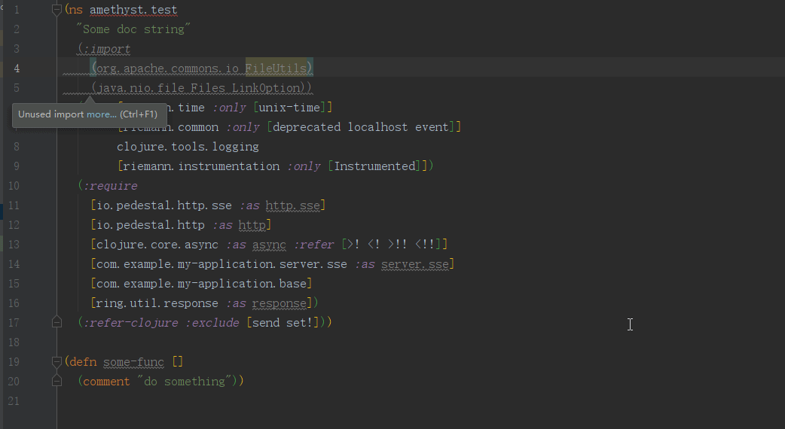
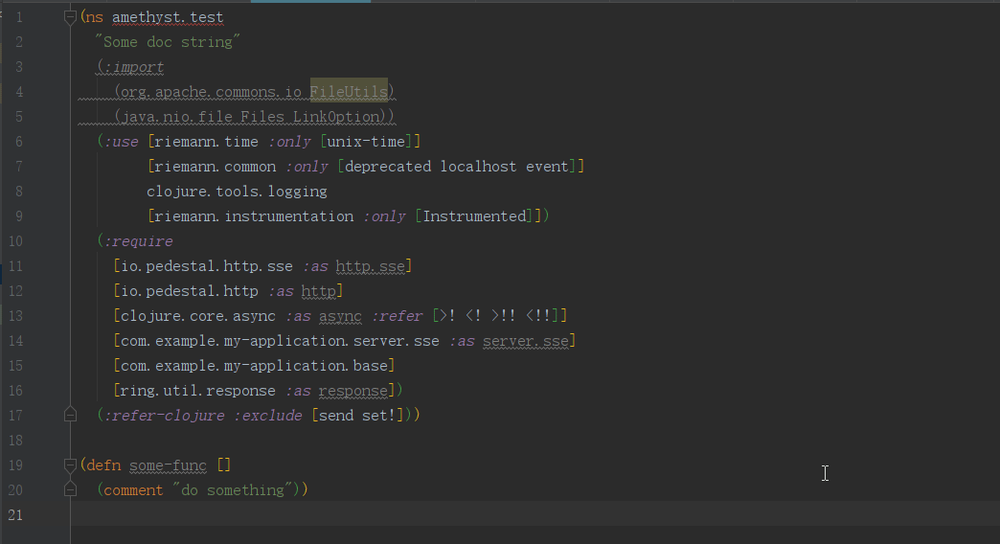

# Amethyst

Clean Clojure Namespace Declarations With An Opinionated Style Guide.

## Feature

This plugin is a port of the [`refactor-nrepl`](https://github.com/clojure-emacs/refactor-nrepl)'s `clean-ns` operation.

- Eliminate `:use` clauses in favor of `refer` `:all`.
- Sort required libraries, imports and vectors of referred symbols.
- Remove any duplication in the `:require` and `:import` form.

## Install

<kbd>Preferences(Settings)</kbd> ->
<kbd>Plugins</kbd> ->
<kbd>Marketplace</kbd> -> 
<kbd>Search "Amethyst"</kbd> -> 
<kbd>Install Plugin</kbd>

## Usage

- Right click mouse -> clean ns

- <kbd>Ctrl</kbd> + <kbd>Shift</kbd> + <kbd>A</kbd> -> clean ns

